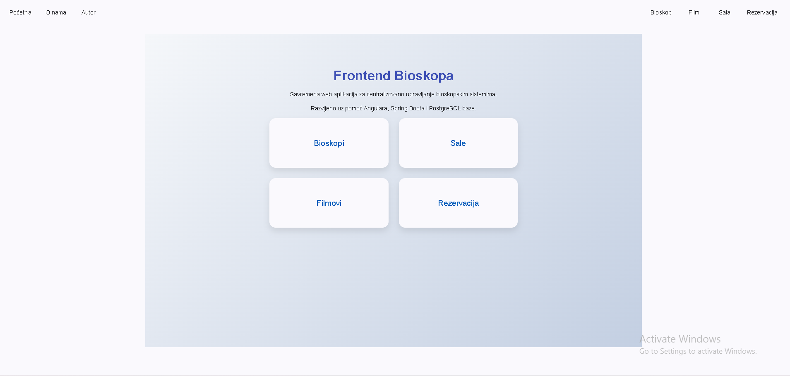

# Cinema Reservation System

A full-stack web application for managing cinemas, halls, movies, and ticket reservations. The backend is a Spring Boot REST API backed by PostgreSQL, and the frontend is an Angular single-page app built with Angular Material.

Built as a university project for the *Multilayer Applications Development* course (Faculty of Technical Sciences, Novi Sad).



## Tech Stack

| Layer | Technologies |
|---|---|
| Backend | Java 17, Spring Boot 4, Spring Web MVC, Spring Data JPA / Hibernate, Bean Validation |
| Database | PostgreSQL |
| Frontend | Angular 22, TypeScript, Angular Material, RxJS |
| Testing | JUnit 5, Spring Boot Test (integration tests) |
| Build tools | Maven (wrapper included), npm / Angular CLI |

## Features

- **CRUD for four related entities:** cinemas, halls, movies, and reservations, each with its own page and create/edit dialogs.
- **Relational model with JPA/Hibernate:** a cinema has many halls (`@OneToMany`), and each reservation references one movie and one hall (`@ManyToOne`).
- **Server-side validation** with Bean Validation (`@NotBlank`, `@Size`, `@Min`, `@Max`, `@NotNull`) and proper HTTP status codes (`201 Created`, `400`, `404`, `409 Conflict`).
- **Search and filter endpoints**, for example movies by name, genre, or rating; reservations by date, paid status, or number of people; halls by cinema, capacity, or number of rows.
- **Layered architecture:** controller, service (interface + implementation), and repository layers.
- **Seed data** loaded from `data.sql` on startup, so the app has content right away.
- **Integration tests** for all four REST controllers (create, update, delete).

## Data Model

> The domain uses Serbian names in code: `Bioskop` = Cinema, `Sala` = Hall, `Film` = Movie, `Rezervacija` = Reservation.

```
Bioskop (cinema) 1 ──── * Sala (hall)
                              │ *
                              │
Film (movie)     1 ──── * Rezervacija (reservation) * ──── 1 Sala
```

| Entity | Fields |
|---|---|
| Bioskop | `id`, `naziv` (name), `adresa` (address) |
| Sala | `id`, `kapacitet` (capacity), `brojRedova` (rows), `bioskop` |
| Film | `id`, `naziv` (title), `zanr` (genre), `trajanje` (duration in minutes), `recenzija` (rating 1–10) |
| Rezervacija | `id`, `brojOsoba` (people), `cenaKarte` (ticket price), `datum` (date), `placeno` (paid), `film`, `sala` |

## REST API

Base URL: `http://localhost:8080`

| Resource | Endpoints |
|---|---|
| `/bioskop` | `GET /`, `GET /{id}`, `GET /naziv/{naziv}`, `GET /adresa/{adresa}`, `POST /`, `PUT /`, `DELETE /{id}` |
| `/sala` | `GET /`, `GET /{id}`, `GET /kapacitet/{kapacitet}`, `GET /redovi/{brojRedova}`, `GET /bioskop/{id}`, `POST /`, `PUT /`, `DELETE /{id}` |
| `/film` | `GET /`, `GET /{id}`, `GET /naziv/{naziv}`, `GET /zanr/{zanr}`, `GET /recenzija/{recenzija}`, `POST /`, `PUT /`, `DELETE /{id}` |
| `/rezervacija` | `GET /`, `GET /{id}`, `GET /placeno/{placeno}`, `GET /datum/{datum}`, `GET /osobe/{brojOsoba}`, `GET /sala/{id}`, `POST /`, `PUT /`, `DELETE /delete/{id}` |

## Project Structure

```
.
├── BackendProject/            # Spring Boot REST API
│   └── src
│       ├── main/java/rva
│       │   ├── controller/    # REST controllers
│       │   ├── service/       # Service interfaces
│       │   ├── implementation/# Service implementations
│       │   ├── repository/    # Spring Data JPA repositories
│       │   └── model/         # JPA entities
│       ├── main/resources     # application.properties, data.sql
│       └── test/java/rva      # Integration tests
└── FrontendProject/           # Angular app
    └── src/app
        ├── components/main    # Pages: bioskop, sala, film, rezervacija
        ├── components/dialogs # Create/edit dialogs
        ├── components/utility # Home, About, Author
        ├── services           # HTTP services for the API
        └── models             # TypeScript interfaces
```

## Getting Started

### Prerequisites

- JDK 17+
- Node.js (current LTS) and npm
- PostgreSQL

### 1. Clone the repository

```bash
git clone https://github.com/milicaantic/cinema-reservation-system.git
cd cinema-reservation-system
```

### 2. Set up the database

Create an empty PostgreSQL database. The default name in the configuration is `IT-33-2023`:

```sql
CREATE DATABASE "IT-33-2023";
```

Then open `BackendProject/src/main/resources/application.properties` and set your own credentials (or a different database name):

```properties
spring.datasource.url = jdbc:postgresql://localhost:5432/IT-33-2023
spring.datasource.username = <your-username>
spring.datasource.password = <your-password>
```

> The schema is generated by Hibernate (`ddl-auto=create-drop`) and filled from `data.sql` on every start. **Data does not persist between runs**, which is convenient for a demo but not for real use.

### 3. Run the backend

```bash
cd BackendProject
./mvnw spring-boot:run        # on Windows: mvnw.cmd spring-boot:run
```

The API starts on `http://localhost:8080`.

### 4. Run the frontend

In a second terminal:

```bash
cd FrontendProject
npm install
npm start
```

Open `http://localhost:4200`. The backend allows CORS requests from this origin.

### 5. Run the tests

The integration tests start the application on port 8080 and call it over HTTP, so PostgreSQL must be running and the port must be free (stop the backend first).

```bash
cd BackendProject
./mvnw test
```

## What I Learned

- Designing a layered Spring Boot application and mapping a relational model with JPA/Hibernate.
- Validating input on the server and returning meaningful HTTP status codes.
- Connecting an Angular frontend to a REST API and building CRUD screens with Angular Material.
- Writing integration tests for REST controllers.

## Author

**Milica Antić** — Information Systems Engineering student, Faculty of Technical Sciences, Novi Sad.
[GitHub](https://github.com/milicaantic)
